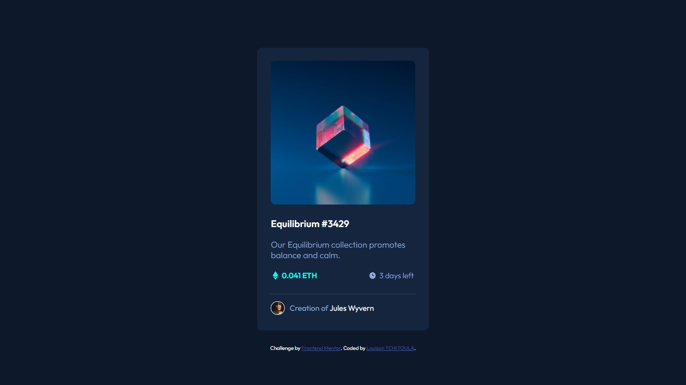

# nft-card-component
Challenge from frontendmentor
This is a solution to the [NFT preview card component challenge on Frontend Mentor](https://www.frontendmentor.io/challenges/nft-preview-card-component-SbdUL_w0U).

## Table of contents

- [Overview](#overview)
  - [The challenge](#the-challenge)
  - [Screenshot](#screenshot)
  - [Links](#links)
- [My process](#my-process)
  - [Built with](#built-with)
  - [What I learned](#what-i-learned)
  - [Useful resources](#useful-resources)
- [Author](#author)


## Overview

### The challenge

Users should be able to:

- View the optimal layout depending on their device's screen size
- See hover states for interactive elements

### Screenshot




### Links

- Solution URL: [Add solution URL here](https://your-solution-url.com)

## My process

### Built with

- Semantic HTML5 markup
- CSS with Sass 
- Flexbox


### What I learned

My goal was to get a first try at using Sass compiling instead of normal CSS. 

Using modules and setting them up first is a lot more efficient.
```scss
$main-bg: hsl(217, 54%, 11%);
$card-bg: hsl(216, 50%, 16%);
$line-color: hsl(215, 32%, 27%);
$white: white;
$primary1: hsl(215, 51%, 70%);
$primary2: hsl(178, 100%, 50%);
```
Being able to nest selector makes the code more readable and easier to handle when reviewing.
```scss 
.nft-pricing-time {
        display: flex;
        justify-content: space-between;
        margin-top: 1440px *1.5 /100;
        border-bottom: 1px solid $line-color;
        padding-bottom: 1440px* 1.5 /100;
        .eth-amount, .clock {
            display: flex;
            width: 1440px *7/100;
            align-items: center;
            justify-content: space-between;
        }
        .eth-amount {
            color: $primary2;
        }
    }
```


### Useful resources

- [Sass crash course from Traversy Media](https://www.youtube.com/watch?v=nu5mdN2JIwM&t=307s&ab_channel=TraversyMedia) This helped me for before starting the project to visualize what my workflow might look like.
- [Sass Documentation](https://sass-lang.com/documentation/variables) And of course the document has been very useful.

## Author

- Frontend Mentor - [@LTOssian](https://www.frontendmentor.io/profile/LTOssian)
- Twitter - [@louisantch](https://www.twitter.com/louisantch)

